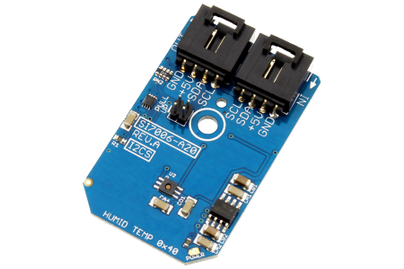

[](https://www.controleverything.com/content/Humidity?sku=SI7006-A20_I2CS)
# SI7006-A20
SI7006-A20 Humidity and Temperature Sensor

The SI7006-A20 is a fully integrated Humidity and Temperature Sensor.

This Device is available from ControlEverything.com [SKU: SI7006-A20_I2CS]

https://www.controleverything.com/content/Humidity?sku=SI7006-A20_I2CS

This Sample code can be used with Raspberry pi, Arduino and Beaglebone Black.

## Java
Download and install pi4j library on Raspberry pi. Steps to install pi4j are provided at:

http://pi4j.com/install.html

Download (or git pull) the code in pi.

Compile the java program.
```cpp
$> pi4j SI7006_A20.java
```

Run the java program.
```cpp
$> pi4j SI7006_A20
```

## Python
Download and install smbus library on Raspberry pi. Steps to install smbus are provided at:

https://pypi.python.org/pypi/smbus-cffi/0.5.1

Download (or git pull) the code in pi. Run the program.

```cpp
$> python SI7006_A20.py
```

## Arduino
Download and install Arduino Software (IDE) on your machine. Steps to install Arduino are provided at:

https://www.arduino.cc/en/Main/Software

Download (or git pull) the code and double click the file to run the program.

Compile and upload the code on Arduino IDE and see the output on Serial Monitor.


## C

Setup your BeagleBone Black according to steps provided at:

https://beagleboard.org/getting-started

Download (or git pull) the code in Beaglebone Black.

Compile the c program.
```cpp
$>gcc SI7006_A20.c -o SI7006_A20
```
Run the c program.
```cpp
$>./SI7006_A20
```

## Onion Omega

Get Started and setting up the Onion Omega according to steps provided at :

https://wiki.onion.io/Get-Started

To install the Python module, run the following commands:
```cpp
opkg update
```
```cpp
opkg install python-light pyOnionI2C
```

Download (or git pull) the code in Onion Omega. Run the program.

```cpp
$> python SI7006_A20.py
```
#####The code output is the relative humidity in %RH and temperature reading in degree celsius and fahrenheit.
